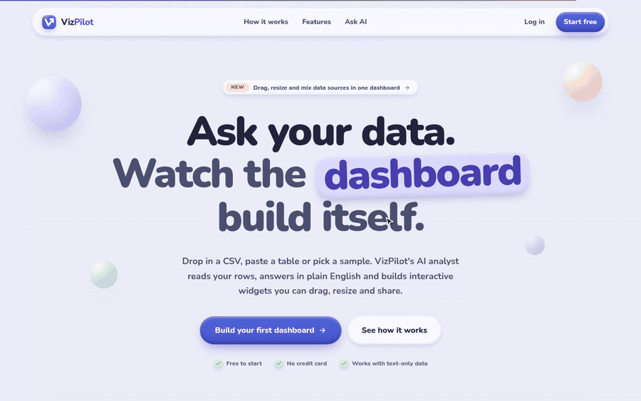
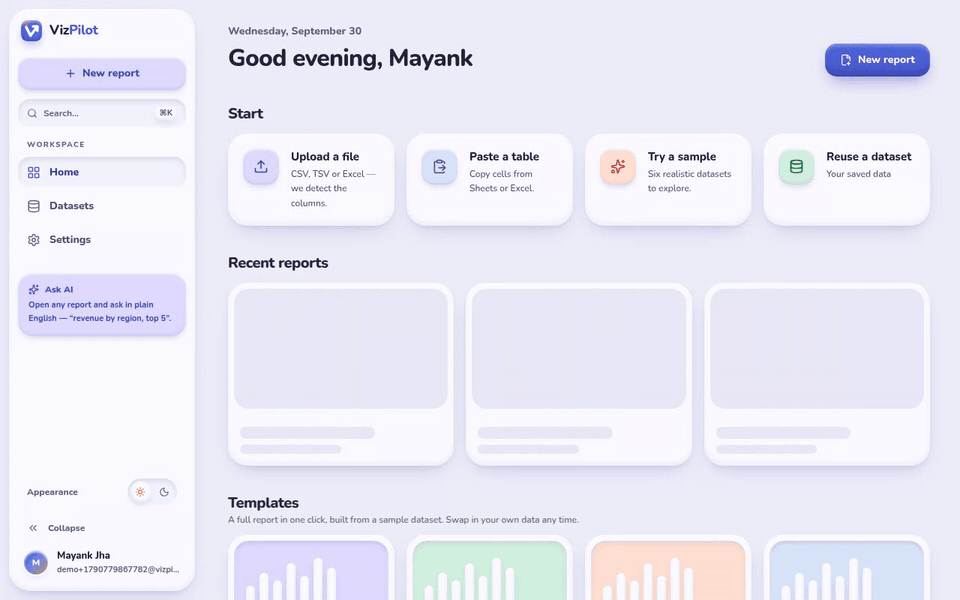
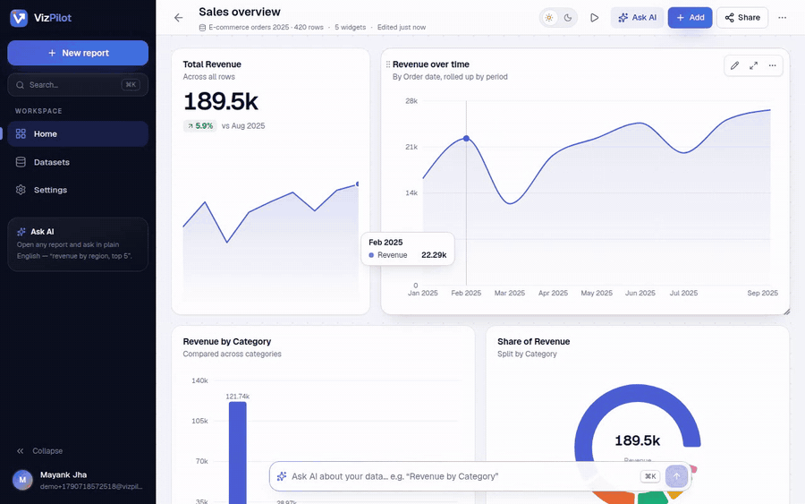
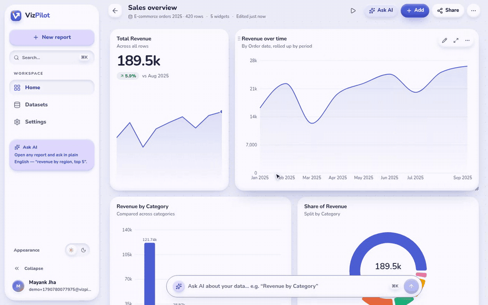
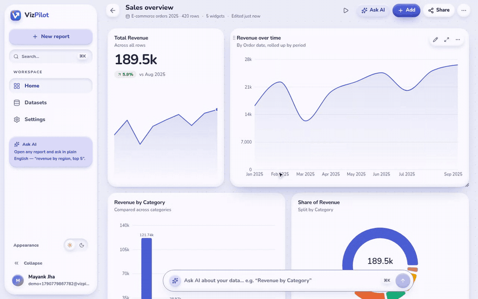
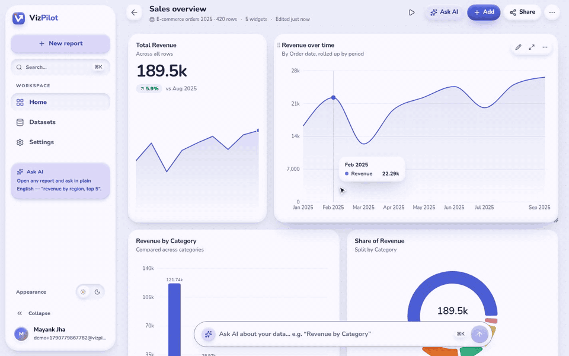
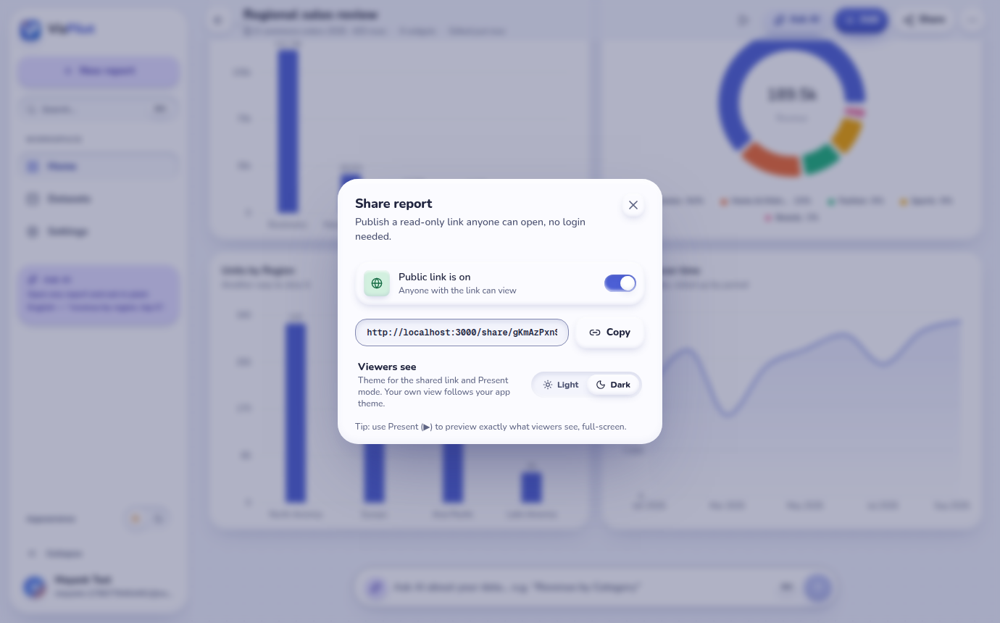
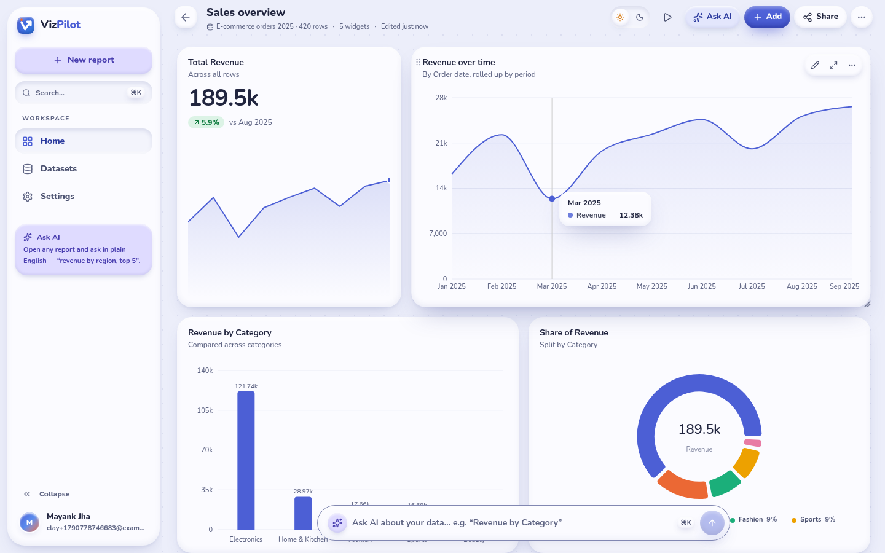
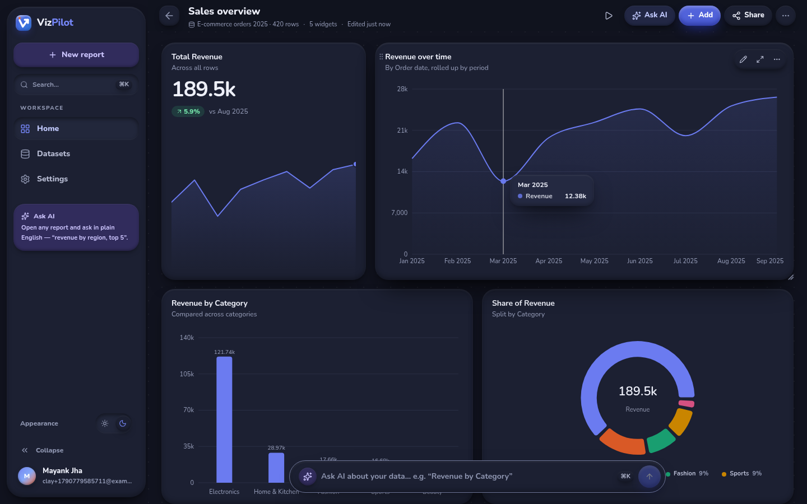

<div align="center">

# VizPilot

**Ask your data a question. Watch the dashboard build itself.**

Drop in a CSV, paste a table or pick a sample. VizPilot's AI analyst reads your rows, answers in plain English and builds interactive widgets you can drag, resize, restyle and share, all in a soft, tactile **claymorphism** design, in light and dark.

**[🚀 Live demo → vizpilot-puce.vercel.app](https://vizpilot-puce.vercel.app)**




</div>

---

## See it in action

### 1. A full dashboard in one click

Pick a template (or upload your own file) and VizPilot lays out a starter dashboard: a KPI, a trend and breakdowns.



### 2. Ask AI, get a chart

Type a question into the bar at the bottom. The AI plans the analysis, computes the numbers from your real rows and shows **how it built the chart**. Follow up in plain words ("make it a bar chart", "top 5", "monthly"), then add it to the dashboard.



### 3. Drag and resize anything

Grab a widget by its title to move it. Pull the right edge, bottom edge or corner to resize. Neighbours move out of the way, the drop spot shows as a "pressed-in" slot, and the layout saves on its own.



### 4. Chart studio

Every widget opens in a full-screen studio: switch the chart type, change the palette, set its size on the dashboard, edit the data, or ask AI to change it for you.



### 5. Dark mode for you, a separate theme for viewers

- **Your app theme** (Light / Dark / System) changes every page. Use the switch at the bottom of the sidebar or **Settings → Appearance**. *System* follows your computer and is the default.
- **Each report's viewer theme** decides what people see on the shared link and in Present mode. Set it in **Share → Viewers see**. It never changes your own view.





<table>
  <tr>
    <td></td>
    <td></td>
  </tr>
  <tr>
    <td align="center">Light</td>
    <td align="center">Dark</td>
  </tr>
</table>

---

## Features

| | |
| --- | --- |
| **Bring any data** | CSV, TSV and Excel upload, paste from Sheets/Excel, a manual table, or 6 realistic samples (e-commerce, SaaS, marketing, support, web traffic, expenses). Column types are detected for you. |
| **Ask AI** | Plain-English questions become charts, direct answers or insights. It shows each step (grouping, sum/average, filters, sort) so you can trust the numbers. |
| **12 widget types** | Column, bar, stacked, line, area, pie, donut, scatter, KPI (with period-over-period change and a trend line), table and text. |
| **Free-form dashboard** | 12-column grid with drag, resize, auto-reflow and a saved layout per widget. Phones get a simple stacked view. |
| **Mix data sources** | Each widget can use a different dataset, so one report can combine several files. |
| **Smart numbers** | Date roll-ups (day → year), count charts for text-only data, and averages (not sums) for things like scores, hours and rates. |
| **Clay design** | Soft, puffy surfaces with hand-tuned shadows, pastel tints and a rounded font. Built as shared colour tokens, so every screen matches. |
| **Themes** | App-wide Light / Dark / System (remembered, no white flash on load) plus a per-report theme for viewers. |
| **Share** | Public read-only link, Present mode, PNG and CSV export. |
| **Reliable AI** | 7 providers with automatic fallback. If every provider is down, a built-in rules engine still answers. |

---

## The clay design system

VizPilot follows **claymorphism**: things look like soft, moulded clay sitting on a pastel desk. Claymorphism is great for friendly apps but can hurt dense data screens, so VizPilot follows one rule: **clay on the frame, flat on the data**. Cards, buttons, inputs and navigation are puffy; the inside of every chart stays flat and crisp.

| Rule | How it's done |
| --- | --- |
| **3-layer clay shadow** | An outer drop shadow (tinted with the brand colour, never grey) + a soft inner shade at the bottom + a white inner highlight at the top, all lit from above |
| **Pressed-in = selected** | Active nav items, chosen options and inputs look pushed *into* the clay (an inset "well") |
| **Rounded everything** | Cards 24–30px, controls 16px+, chips fully round; Nunito (a rounded font) at chunky weights |
| **Pastel tints** | Lavender, sky, mint, peach, lemon and pink, each paired with a dark text colour that passes contrast |
| **One bright button per screen** | Only the main action uses the saturated brand clay; everything else is soft |
| **Dark clay** | Re-designed rather than inverted: a deep indigo background, lighter moulded surfaces and faint highlights (a bright highlight would look like a grey smudge on dark) |
| **Accessible** | All text ≥ 4.5:1 contrast, input edges ≥ 3:1, solid focus rings, checked with an axe scan in both themes |

All of it lives as CSS variables in [`src/app/globals.css`](src/app/globals.css) (`--card-shadow`, `--clay-inset`, `--clay-brand`, `--clay-*` tints) with helper classes `.clay`, `.clay-inset`, `.clay-press`, `.clay-brand`, `.clay-tile` and `.clay-blob`.

---

## Tech stack

| Layer | Choice |
| --- | --- |
| App | Next.js 16 (App Router, TypeScript), React 19 |
| Styling | Tailwind CSS v4 + clay design tokens; Nunito via `@fontsource-variable/nunito` (no font request at runtime) |
| Charts | Recharts 3 |
| Auth | Firebase Authentication (email/password + Google). The server checks each login token against Google's public keys with `jose`, so it runs on Vercel with no service-account key. |
| Database | MongoDB Atlas via Mongoose (`users`, `datasets`, `reports`, `charts`) |
| AI | Groq → Gemini → Mistral → GitHub Models → OpenRouter → Z.ai → Hugging Face |

---

## Run it locally

**You need:** Node 20+, a MongoDB Atlas database and a Firebase project (or the local Firebase emulator, see below).

```bash
git clone https://github.com/MayankJha0333/VizPilot.git
cd VizPilot
npm install
cp .env.example .env      # fill it in (table below)
npm run dev               # http://localhost:3000
```

### Environment variables

| Name | Required | Where to get it |
| --- | --- | --- |
| `MONGODB_URI` | Yes | Atlas → Connect → Drivers. It can keep the `<db_username>` / `<db_password>` placeholders. |
| `MONGODB_USERNAME`, `MONGODB_PASSWORD` | If the URI has placeholders | Atlas → Database Access |
| `MONGODB_DB` | No (default `vizpilot`) | Any name |
| `NEXT_PUBLIC_FIREBASE_API_KEY`, `..._AUTH_DOMAIN`, `..._PROJECT_ID`, `..._APP_ID`, `..._STORAGE_BUCKET`, `..._MESSAGING_SENDER_ID` | Yes | Firebase console → Project settings → Your apps → Web app |
| `GROQ_API_KEY`, `GEMINI_API_KEY`, `MISTRAL_API_KEY`, `GITHUB_MODELS_TOKEN`, `OPENROUTER_API_KEY`, `ZAI_API_KEY`, `HUGGINGFACE_API_KEY` | No, but add at least one for the best Ask AI | Each provider's dashboard |
| `AI_PROVIDER_ORDER` | No | Change the fallback order, e.g. `gemini,groq,mistral` |

In Firebase, turn on **Authentication → Sign-in method → Email/Password** and **Google**, then add `localhost` under **Authentication → Settings → Authorized domains**.

<details>
<summary><b>No Firebase project yet? Use the local emulator</b></summary>

```bash
npm i -g firebase-tools
npm run emulators        # Auth emulator on 127.0.0.1:9099
```

Then in `.env`:

```
NEXT_PUBLIC_FIREBASE_API_KEY=demo-key
NEXT_PUBLIC_FIREBASE_PROJECT_ID=demo-vizpilot
NEXT_PUBLIC_FIREBASE_AUTH_DOMAIN=demo-vizpilot.firebaseapp.com
NEXT_PUBLIC_FIREBASE_APP_ID=1:1:web:demo
NEXT_PUBLIC_FIREBASE_AUTH_EMULATOR_HOST=127.0.0.1:9099
FIREBASE_AUTH_EMULATOR_HOST=127.0.0.1:9099
```

</details>

---

## Deploy on Vercel

[](https://vercel.com/new/clone?repository-url=https%3A%2F%2Fgithub.com%2FMayankJha0333%2FVizPilot&env=MONGODB_URI,NEXT_PUBLIC_FIREBASE_API_KEY,NEXT_PUBLIC_FIREBASE_AUTH_DOMAIN,NEXT_PUBLIC_FIREBASE_PROJECT_ID,NEXT_PUBLIC_FIREBASE_APP_ID&envDescription=See%20the%20README%20for%20where%20to%20find%20each%20value&project-name=vizpilot)

1. **Import the repo** at [vercel.com/new](https://vercel.com/new). Vercel detects Next.js, so no build settings are needed.
2. **Add the environment variables** from the table above. Tip: you can paste your whole `.env` into the first field and Vercel splits it into rows.
3. **Deploy.** After that, every push to `main` redeploys on its own.
4. **Allow the new domain in Firebase:** Authentication → Settings → Authorized domains → add `your-app.vercel.app`. Without this, login shows `auth/unauthorized-domain`.
5. **Allow Vercel in MongoDB Atlas:** Network Access → Add IP Address → **Allow access from anywhere** (`0.0.0.0/0`). Vercel's servers don't have fixed IP addresses; your database password still protects it. Without this, login shows "Could not start your session".

---

<details>
<summary><b>How the themes work</b></summary>

- `src/components/theme/ThemeProvider.tsx` keeps the app theme (`light` / `dark` / `system`) in this browser and sets `data-theme` on `<html>`, so every clay token switches at once.
- `src/components/theme/boot.ts` is a tiny script in `<head>` that applies the saved theme **before the first paint**, so a dark-mode user never sees a white flash.
- A report's `theme` field is only used by the public share page and Present mode; both set their own `data-theme`, so viewers see the report the way you chose.

</details>

<details>
<summary><b>How the AI fallback works</b></summary>

Code lives in `src/lib/ai/`.

- `providers.ts`: one adapter per provider (OpenAI-compatible endpoints + Gemini). On start it reads each provider's live model list and picks the best available model, so retired model names don't break it.
- `client.ts`: tries providers in order. Each failure is sorted into a type (`auth`, `quota`, `model_unavailable`, `rate_limit`, `server`, `timeout`, `network`, `bad_response`) and that provider rests for a while (a cooldown), so the next request skips straight to a healthy one. It also retries without settings a model rejects, and retries "thinking" models that return empty replies.
- `analyst.ts`: the Ask AI engine. It gives the model a short brief of your dataset, asks it for a plan (chart / answer / insights), checks the plan against your real columns, then computes every number from your rows. The model never makes up numbers.
- **Settings → AI providers** shows each provider's live status and lets you test them and clear cooldowns.

</details>

<details>
<summary><b>Project layout</b></summary>

```
src/
  app/
    (marketing)/page.tsx        Landing page
    (auth)/                     Login, sign up, forgot password
    (app)/                      Signed-in area
      dashboard/                Home: start cards, recent reports, templates, datasets
      reports/                  All reports
      reports/new/              Add data → set up report
      reports/[id]/             Report editor: grid, chart studio, Ask AI, present, share
      datasets/                 Dataset list + editable table
      settings/                 Profile, appearance, AI providers
    share/[shareId]/            Public read-only report (uses the report's viewer theme)
    api/                        REST routes (all check the Firebase login token)
    globals.css                 Clay design tokens (light + dark) and helper classes
  components/
    theme/                      App theme provider, sidebar switch, Settings picker, no-flash boot script
    charts/                     Grid, widget, chart renderer, chart studio
    layout/  ui/  data/  reports/  ai/  auth/  marketing/
  lib/
    ai/                         Providers, fallback client, analyst
    charts/                     Types, palettes, suggestions, natural-language rules
    data/                       Parsing, aggregation, dates, samples
    layout/grid.ts              Dashboard grid maths (move, resize, compact)
    models/                     Mongoose models
    firebase/                   Client SDK + server-side token check (jose)
```

</details>

<details>
<summary><b>API routes</b></summary>

| Method | Route | What it does |
| --- | --- | --- |
| POST / DELETE | `/api/auth/session` | Sync the Firebase user into MongoDB, set/clear the session cookie |
| GET / POST | `/api/datasets` | List / create datasets |
| GET / PATCH / DELETE | `/api/datasets/:id` | Read / edit / delete (blocked while a widget uses it) |
| GET / POST | `/api/reports` | List with previews / create (optionally auto-build widgets) |
| GET / PATCH / DELETE | `/api/reports/:id` | Read / update (title, viewer `theme`, public, `layouts`) / delete |
| POST | `/api/reports/:id/duplicate` | Copy a report and its widgets |
| POST | `/api/charts` | Add a widget |
| PATCH / POST / DELETE | `/api/charts/:id` | Update / duplicate / delete a widget |
| POST | `/api/ai/ask` | Ask AI → chart, answer or insights, plus the steps it took |
| GET / POST | `/api/ai/providers` | Provider status, test, reset cooldowns |
| GET | `/api/share/:shareId` | Public report data |
| GET | `/api/health` | Database, Firebase and AI status |

</details>

## Scripts

```bash
npm run dev         # development server
npm run build       # production build
npm run start       # serve the production build
npm run lint        # ESLint
npm run typecheck   # TypeScript
npm run emulators   # Firebase Auth emulator
```

---

<div align="center">
Built by <a href="https://github.com/MayankJha0333">Mayank Jha</a> · Inspired by <a href="https://graphy.app">Graphy</a>
</div>
